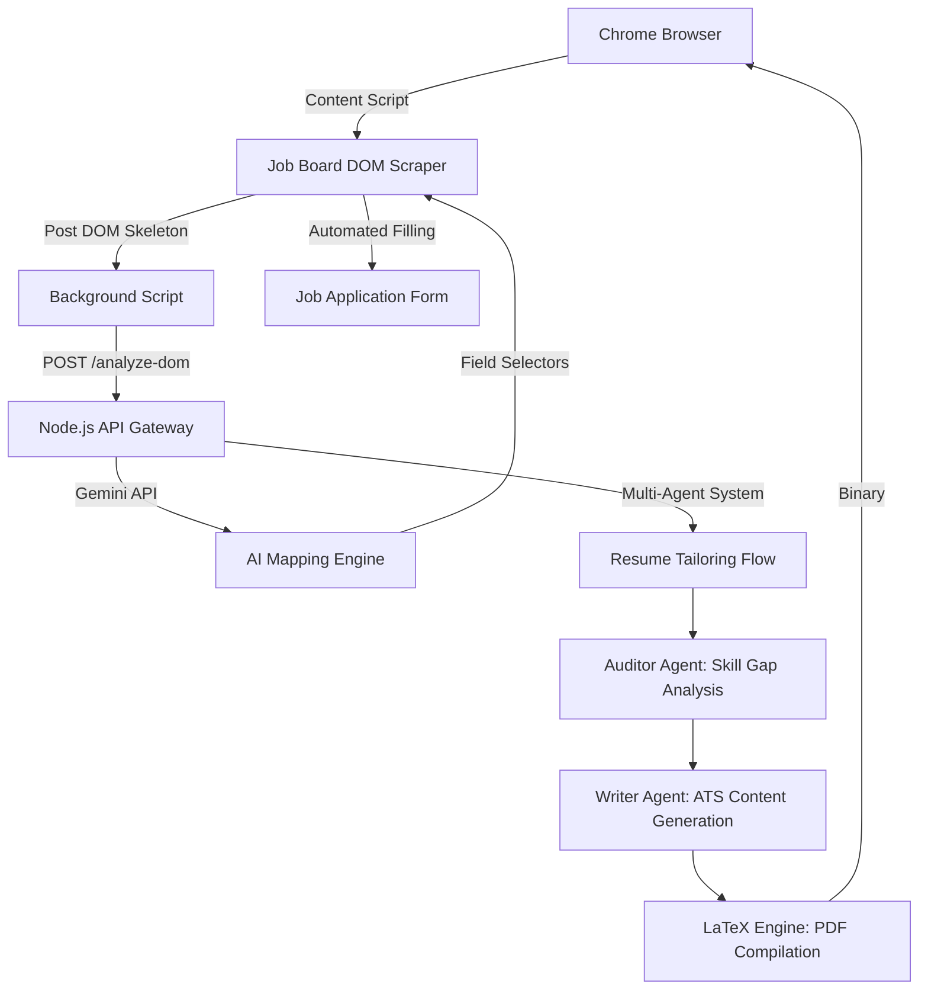

## Architecture Diagram

THIS PROJECT IS STILL UNDER DEVELOPMENT



# AI-Job-Applicator\n\n  \n\n> Your personal AI-driven recruitment agent that automates the tedious parts of the job search, from form-filling to dynamic resume generation.\n\n## 📖 Table of Contents\n- [Overview](#-overview)\n- [Key Features](#-key-features)\n- [Architecture & Tech Stack](#-architecture--tech-stack)\n- [Directory Structure](#-directory-structure)\n- [Getting Started](#-getting-started)\n- [API Reference / Usage](#-api-reference--usage)\n- [Contributing](#-contributing)\n- [License](#-license)\n\n## 🚀 Overview\nAI-Job-Applicator is a sophisticated full-stack tool consisting of a Chrome Extension and a Node.js backend. It solves the efficiency problem in modern job hunting. Unlike basic autofillers, this system uses a hybrid approach: specialized blueprints for common Applicant Tracking Systems (ATS) like Greenhouse or Lever, and a Large Language Model (LLM) backend to handle custom, complex questions on non-standard job boards. It also features a multi-agent AI pipeline to tailor resumes to specific job descriptions using LaTeX for professional-grade output.\n\n## ✨ Key Features\n- **Tiered Autofill Logic**: \n  - *Fast Lane*: Instant filling for known ATS (Greenhouse, Lever, Ashby) using hardcoded CSS blueprints.\n  - *AI Lane*: For unknown sites, it sends a DOM skeleton to the backend where Gemini maps fields to user profiles.\n- **Multi-Agent Resume Tailoring**: \n  - **Auditor Agent**: Performs a strict gap analysis between the user's resume and a job description.\n  - **Writer Agent**: Rewrites experience bullets to mirror job-specific keywords and requirements.\n  - **LaTeX Orchestrator**: Dynamically compiles a high-quality PDF using `pdflatex`.\n- **Application Tracking**: Automatically logs job titles, companies, and dates to local storage upon submission.\n- **AI Cover Letter Generator**: Creates context-aware, 150-word professional cover letters on demand.\n\n## 🏗️ Architecture & Tech Stack\n- **Frontend (Extension)**: React-based UI built with Vite and Tailwind. The `content.js` script handles DOM manipulation and site-specific scraping, while `background.js` manages cross-origin communication with the API.\n- **Backend (Node.js)**: An Express server acting as an orchestrator for the Google Gemini AI. It utilizes `multer` for resume uploads and `child_process` to execute LaTeX commands.\n- **AI Engine**: Google Generative AI (Gemini) powers the parsing, auditing, and creative writing modules.\n- **Design Patterns**: Employs a Strategy Pattern for handling different job boards (`known_sites.js`) and a Chain-of-Responsibility pattern for resume tailoring.\n\n## 📁 Directory Structure\n```text\n├── extension/                # React/Vite Chrome Extension\n│   ├── src/background/       # Background service workers for API calls\n│   ├── src/content/          # DOM scraping and autofill logic\n│   ├── src/components/       # UI dashboard and persona management\n│   └── manifest.json         # Extension configuration\n├── server/                   # Node.js Express Backend\n│   ├── tailor-resume/        # Multi-agent AI core\n│   │   ├── agents/           # Auditor, Writer, and Parser logic\n│   │   ├── prompts/          # System instructions for LLMs\n│   │   └── utils/            # LaTeX generation utility\n│   ├── uploads/              # Temporary storage for resume PDFs\n│   └── index.js              # Main API entry point\n└── README.md                 # Project documentation\n```\n\n## 🛠️ Getting Started\n\n### Prerequisites\n- **Node.js**: v18.x or higher\n- **Google Cloud API Key**: Required for Gemini access.\n- **LaTeX**: Must have `pdflatex` installed (e.g., TeX Live or MiKTeX) for resume generation.\n\n### Environment Variables\nCreate a `.env` file in the `server/config/` directory:\n\n| Variable | Description | Example |\n| :--- | :--- | :--- |\n| `GOOGLE_API_KEY` | Your Gemini Pro API Key | `AIzaSy...` |\n\n### Installation & Running Locally\n\n1. **Setup Backend**:\n   ```bash\n   cd server\n   npm install\n   node index.js\n   ```\n\n2. **Setup Extension**:\n   ```bash\n   cd extension\n   npm install\n   npm run dev\n   ```\n\n3. **Load in Chrome**:\n   Navigate to `chrome://extensions`, enable "Developer mode", click "Load unpacked", and select the `extension/dist` folder.\n\n## 🔌 API Reference / Usage\n\n### POST `/analyze-dom`\nUsed to map custom application questions to user profile data.\n- **Payload**: `{ domSkeleton: [...], userProfile: {...} }`\n- **Response**: `{ success: true, fieldMappings: { "#selector": "value" } }`\n\n### POST `/tailor-resume`\nInitiates the multi-agent tailoring process.\n- **Payload**: `{ userProfile: {...}, jobDescription: "..." }`\n- **Response**: Binary PDF Stream (Tailored Resume).\n\n### POST `/generate-cover-letter`\nGenerates a short, professional cover letter.\n- **Payload**: `{ resumeText: "...", jobDescription: "..." }`\n- **Response**: `{ coverLetter: "..." }`\n\n## 🤝 Contributing\n1. Fork the Project.\n2. Create your Feature Branch (`git checkout -b feature/AmazingFeature`).\n3. Commit your Changes (`git commit -m 'Add some AmazingFeature'`).\n4. Push to the Branch (`git push origin feature/AmazingFeature`).\n5. Open a Pull Request.\n\n## 📜 License\nDistributed under the MIT License. See `LICENSE` for more information.
