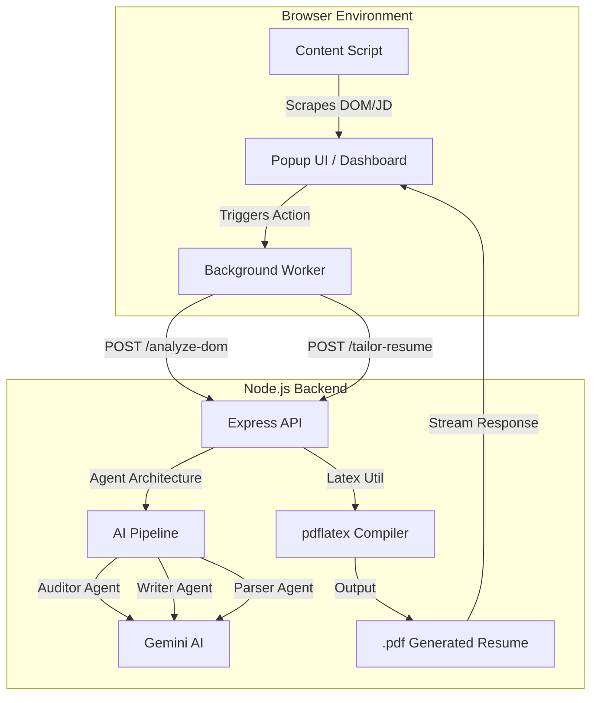

## Architecture Diagram

This project is still under development



# ApplyAI: Autonomous Resume & Job Application Suite

   

> The ultimate AI-powered suite for job seekers. Automate complex job forms, analyze ATS compatibility, and generate perfectly tailored LaTeX resumes using a multi-agent AI architecture.

## 📖 Table of Contents
- [🚀 Overview](#-overview)
- [✨ Key Features](#-key-features)
- [🏗️ Architecture & Tech Stack](#-architecture--tech-stack)
- [📁 Directory Structure](#-directory-structure)
- [🛠️ Getting Started](#-getting-started)
- [🔌 API Reference / Usage](#-api-reference--usage)
- [🤝 Contributing](#-contributing)
- [📜 License](#-license)

## 🚀 Overview
ApplyAI is a sophisticated tool designed to eliminate the manual overhead of job searching. It consists of a **Chrome Extension** that interacts directly with job boards and a **Node.js Backend** that orchestrates an AI-driven multi-agent pipeline. Unlike simple autofill tools, ApplyAI uses LLMs to understand "unknown" site structures and strategically rewrites your resume content to maximize ATS (Applicant Tracking System) scores based on specific job descriptions.

## ✨ Key Features
- **Hybrid Autofill Engine**: Uses `known_sites.js` for instant mapping on major ATS platforms (Greenhouse, Lever, Ashby) and falls back to an AI-driven DOM analysis for custom job boards.
- **Multi-Agent Resume Tailoring**:
    - **Auditor Agent**: Critically analyzes your resume against a JD to find skill gaps.
    - **Writer Agent**: Rewrites bullet points using action verbs and keyword mirroring.
    - **Parser Agent**: Extracts structured JSON data from existing PDF resumes.
- **LaTeX Document Generation**: Compiles professional, industry-standard resumes using the `pdflatex` engine for pixel-perfect typography.
- **Smart Job Tracking**: Automatically logs applications and statuses to local storage upon submission.
- **Cover Letter Generator**: Instant, context-aware cover letters limited to professional, non-fluff language.

## 🏗️ Architecture & Tech Stack
- **Frontend**: A modular React application built with Vite, utilizing the Chrome Extension Manifest V3. Tailwind CSS handles the UI, while `fuse.js` provides fuzzy matching for field identification.
- **Backend**: An Express.js server that acts as a gateway to Google Gemini AI models. It uses a "Pipeline Pattern" where data flows through specialized agents.
- **Storage**: Chrome Local Storage for persistent user profiles and job logs; server-side temporary storage for PDF processing.
- **AI Layer**: Google GenAI (Gemini) integration for JSON-structured outputs and natural language processing.

## 📁 Directory Structure
```text
.
├── extension                 # Chrome Extension Source
│   ├── src/background        # Service workers for network proxying
│   ├── src/content           # DOM scrapers and autofill logic
│   ├── src/components        # Dashboard and Persona UI
│   ├── manifest.json         # Extension configuration
│   └── vite.config.js        # Build pipeline (CRXJS)
├── server                    # Node.js Backend
│   ├── tailor-resume/agents  # AI specialized agents (Auditor, Writer, Parser)
│   ├── tailor-resume/utils   # LaTeX compilation logic
│   ├── tailor-resume/prompts # System prompts for LLM orchestration
│   ├── uploads/              # Temp directory for PDF processing
│   └── index.js              # Express server entry point
└── README.md
```

## 🛠️ Getting Started
### Prerequisites
- **Node.js**: v18.0.0 or higher
- **LaTeX**: A system installation of `pdflatex` (e.g., TeX Live or MiKTeX)
- **Google Gemini API Key**: Obtainable via Google AI Studio

### Environment Variables
Create a `server/config/config.env` file:
| Variable | Description | Example |
| :--- | :--- | :--- |
| GOOGLE_API_KEY | Your Gemini API Key | `AIzaSy...` |
| PORT | Server port | `3000` |

### Installation & Running Locally
1. **Server Setup**:
   ```bash
   cd server
   npm install
   node index.js
   ```
2. **Extension Setup**:
   ```bash
   cd extension
   npm install
   npm run build
   ```
3. **Load Extension**: Open Chrome -> `chrome://extensions` -> Enable 'Developer Mode' -> 'Load Unpacked' -> Select the `extension/dist` folder.

## 🔌 API Reference / Usage
### Resume Tailoring
`POST /tailor-resume`  
Analyzes a user profile against a JD and returns a PDF file.

| Parameter | Type | Description |
| :--- | :--- | :--- |
| userProfile | JSON | The user's parsed resume data |
| jobDescription | String | Raw text of the job description |

### DOM Analysis
`POST /analyze-dom`  
Maps complex form field IDs to profile data points using AI.

## 🤝 Contributing
1. Fork the project.
2. Create your Feature Branch (`git checkout -b feature/AmazingFeature`).
3. Commit your changes (`git commit -m 'Add some AmazingFeature'`).
4. Push to the branch (`git push origin feature/AmazingFeature`).
5. Open a Pull Request.

## 📜 License
Distributed under the MIT License. See `LICENSE` for more information.
